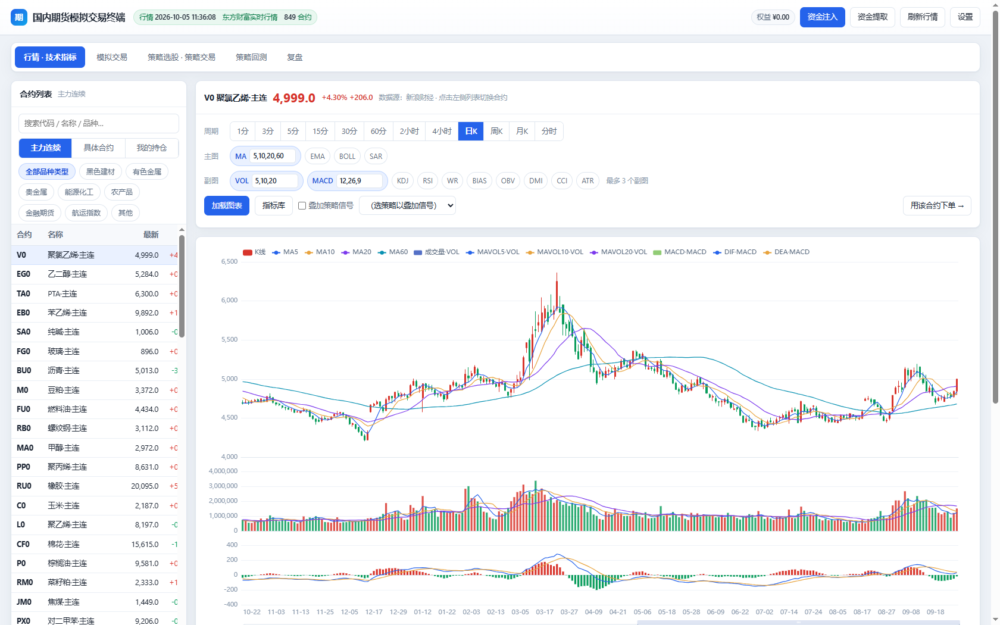
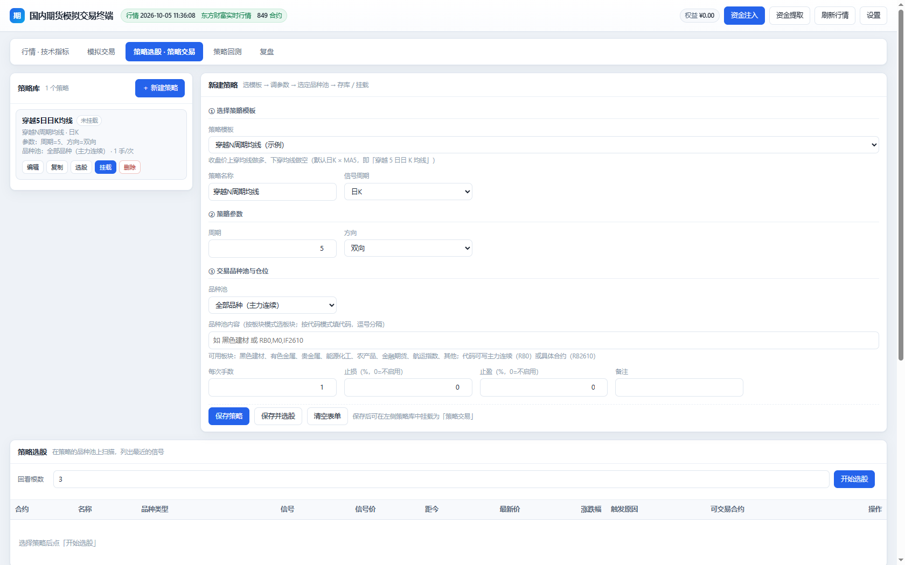
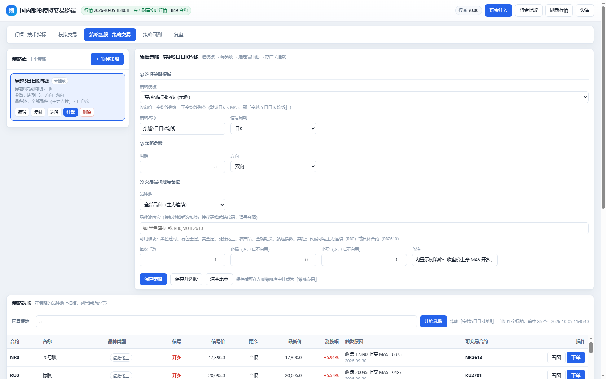
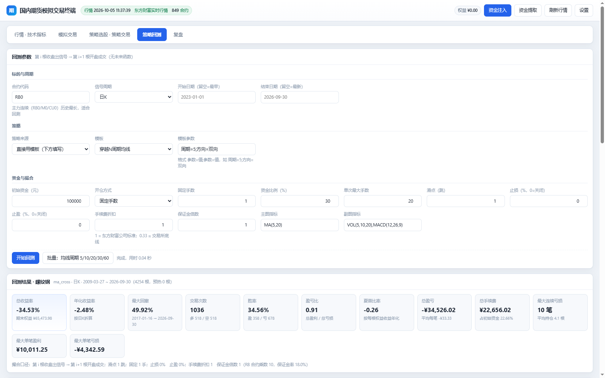
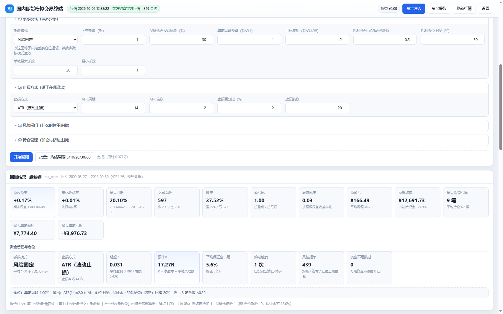
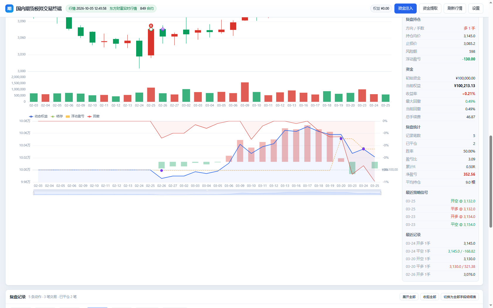
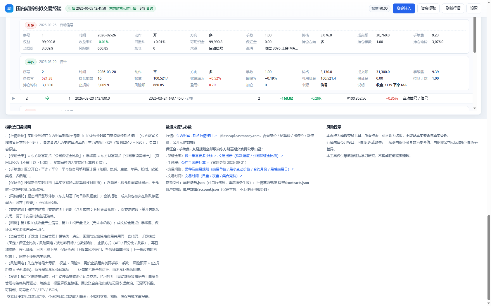
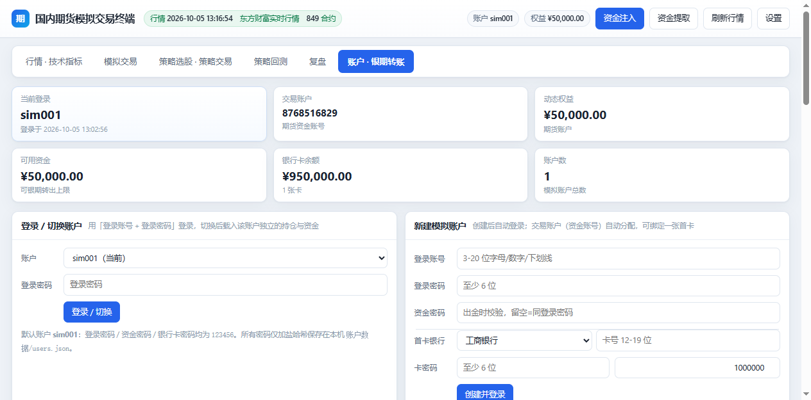
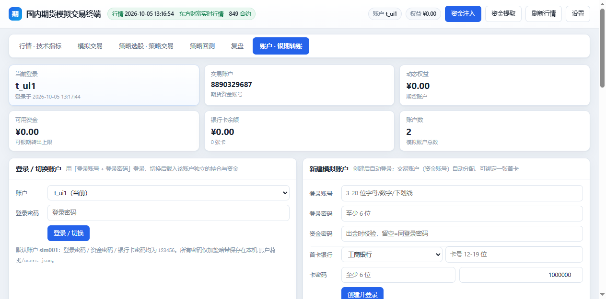
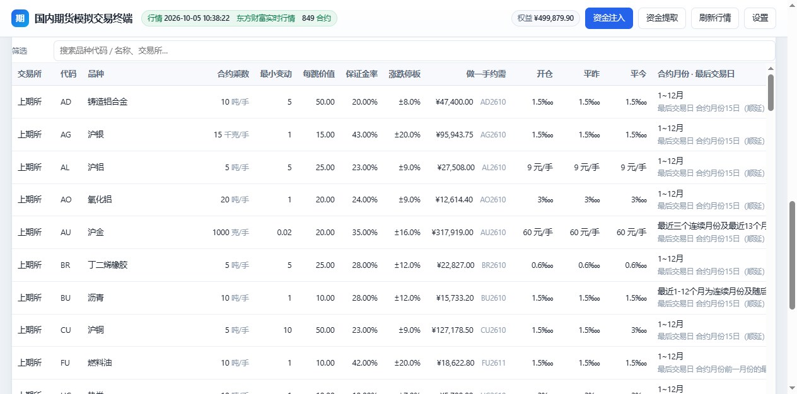

# 国内期货量化模拟交易终端

> 配套「[国内期货数据终端](https://github.com/chenzhuanxin/china-futures-data-terminal)」的**量化模拟交易面板**。
> **纯 Python 标准库 + 单页 HTML，零第三方依赖，数据只存本机，一条命令跑起来。**
>
> **交易规则、手续费、保证金、涨跌停板、交易时段全部对齐东方财富期货官网公示口径**，并用官网「做一手保证金金额」逐品种反算对账，**87 个品种偏差全部为 0.00%**。

   

---

## 一、这是什么

一个**本地运行**的国内期货模拟交易系统：启动后在你电脑上起一个本地服务（默认 `http://127.0.0.1:8908/`），浏览器打开就是一个六页签的量化终端——看行情、下模拟单、写策略、跑回测、做复盘、管账户，全部闭环。

它解决的核心痛点：

- 想验证一个期货策略，但不想写代码接 SDK、不想在券商模拟盘上排队等成交；
- 想要**手续费 / 保证金 / 平今加收 / 涨跌停 / 夜盘时段**都跟真实口径一致，而不是拍脑袋的简化模型；
- 想要策略不只是「进出点」，还有**资金管理与手数管理**——做多少手、错了在哪退出、什么时候不许做；
- 想要**复盘**留下完整数据：可折叠、可复制、可导出，还有资金变化曲线。

## 二、功能总览

### ① 行情 · 技术指标

- 全市场 **约 850 个真实月份合约**实时报价（6 大交易所，涨红跌绿，5 秒刷新）；
- 分时图 + **9 个周期 K 线**：1/3/5/15/30/60 分、2/4 小时、日/周/月（周月由日 K 本地合成）；
- 主图指标 **MA / EMA / BOLL / SAR**，副图指标 **VOL / MACD / KDJ / RSI / WR / BIAS / OBV / DMI / CCI / ATR**，参数可改、多组叠加；
- K 线上可直接叠加策略买卖点信号。



### ② 模拟交易

- 买入开多 / 卖出开空 / 平多 / 平空，市价与限价两种方式，挂单撮合、可撤单；
- **今仓 / 昨仓**自动区分，平仓支持自动（先平昨再平今）/ 只平今 / 只平昨；
- 保证金、可用资金、风险度、最多可开手数实时计算；风险度触及强平线自动逐笔强平；
- 涨跌停校验、手续费三档计提（开/平昨/平今）、浮动盈亏逐笔盯市、权益曲线（动态权益/结存/占用保证金）。

### ③ 策略选股 · 策略交易

- **8 个内置策略模板**：穿越 N 周期均线（示例「穿越 5 日日 K 均线」）、双均线金叉死叉、MACD、KDJ、布林带突破、唐奇安通道（海龟）、RSI 超买超卖、自定义条件组合（支持 `MA(5)` 上穿 `MA(20)` 这类表达式）；
- 策略库支持新增 / 编辑 / 复制 / 删除 / 启用停用，持久化保存；
- **策略选股**：一个策略扫全市场（或指定板块 / 合约），列出最新信号与可交易合约；
- **策略交易**：挂载后后台每 30 秒按最新 K 线自动开平仓，可先「仅记录信号」观察再放行下单。





### ④ 资金管理与仓位管理（策略 / 回测 / 复盘三处共用）

策略只负责「什么时候进出」，**做多少手、错了在哪退出、什么时候不许做**由这一层决定：

| 层 | 内容 |
|---|---|
| **手数模式** | 固定手数 / 保证金比例 / **风险固定（推荐：手数 = 权益×风险% ÷ 止损距离金额）** / 波动率目标 / 分数凯利 |
| **止损方式** | ATR（波动止损）/ 百分比 / 固定跳数 / 不设止损 |
| **风险闸门** | 最大回撤熔断（可清仓）、连亏减仓、连亏停手、日内亏损上限、保证金占用上限、单笔手数上下限 |
| **持仓管理** | 金字塔加仓（浮盈达标按比例递增加仓）、移动止损（保本 / 跟随 ATR） |

**4 套科学预设一键套用**：稳健趋势（推荐）、海龟式趋势（加仓）、保守低频（低回撤）、波动率均衡（自适应）。
回测与实盘挂载**共用同一套资金管理代码**，回测里看到的手数行为就是实盘行为。

### ⑤ 策略回测

- **无未来函数**：第 i 根收盘出信号 → 第 i+1 根开盘成交，手数按上一根收盘权益由资金管理算出；
- 输出**绩效卡片**（总收益/年化/最大回撤/胜率/盈亏比/夏普/连续亏损…）+ **资金管理 KPI**（期望 R / 累计 R / 平均与峰值保证金占用 / 熔断次数 / 风控拒单）；
- K 线买卖点图 + 净值曲线 + 逐笔交易明细（含止损价 / 风险额 / R 倍数 / 离场类型）；
- 支持批量参数扫描，历史回测可回看。





### ⑥ 复盘

- **手动练习**与**自动跟随策略信号**两种模式，逐根回放，可拖进度条、自动播放调速；
- 双图：K 线 + 成交点，下方**资金变化曲线**（动态权益 / 结存 / 浮动盈亏柱 / 回撤双轴）；
- **复盘记录**：默认折叠视图，点行展开该笔全部 **24 个字段**（手续费/可用资金/保证金/止损价/风险额/盈亏R/来源/说明…）；可切换 24 列明细表；
- **可复制**（CSV / TSV / 文本摘要）**可导出**（CSV / TSV / JSON / JSONL，文件头带元信息与统计），**结束复盘后依然可用**。





### ⑦ 账户 · 银期转账

- **多模拟账户**：登录账号 / 登录密码 / 交易账户（资金账号）/ 资金密码，状态完全隔离（独立持仓、委托、成交、资金、权益曲线），可添加 / 删除 / 切换；
- **模拟银行卡**：12 家银行、卡号 12-19 位校验、卡内余额独立、可添加 / 解绑；
- **银期转账**：转入验**银行交易密码**；转出验**银行交易密码 + 资金密码**且不超可用资金；每笔双边留痕；
- 所有密码**加盐 sha256** 落盘本机，接口不回传明文。





### 规则与费率

面板内置「交易规则与费率」标签页：91 个品种全参数一览（合约乘数、最小变动价位、每跳价值、保证金率、手续费三档、涨跌停、日盘/夜盘时段），可搜索，含「做一手约需」实时估算。



## 三、快速开始

**方式一（最简）：下载 Release 里的 exe**

到 [Releases](../../releases) 下载 `futures-sim-terminal-v1.0.0-win64.exe`（约 10 MB 单文件），双击即可——自带 Python 运行时，**无需安装 Python、无需联网装依赖**，数据保存在 exe 旁边（绿色便携）。

**方式二：源码运行**

到 [Releases](../../releases) 下载源码包 `futures-sim-trading-terminal-v1.0.0-source.zip`（约 2.7 MB，解压即用），或直接克隆仓库：

```bash
git clone https://github.com/chenzhuanxin/futures-sim-trading-terminal.git
cd futures-sim-trading-terminal
python 模拟交易服务.py          # 或双击 启动模拟交易.bat
```

- 纯标准库，**不需要 `pip install` 任何东西**（Python 3.9+ 即可）；
- 浏览器自动打开 `http://127.0.0.1:8908/`；关闭窗口即停止服务；端口被占用自动向后寻找空闲端口；
- 首次启动自动创建默认账户 **sim001**（登录密码 / 资金密码 / 银行卡密码均为 `123456`，带一张 100 万余额的工商银行卡）。

**首次使用**：到「账户 · 银期转账」页用银期转账注入资金（或右上角「资金注入」快捷通道）→ 左侧点任意合约 → 下单。

## 四、目录结构

```
futures-sim-trading-terminal/
├── 模拟交易服务.py        # 后端服务（纯标准库：行情/账户/撮合/风控/持久化/API 路由）
├── 行情K线.py             # 行情模块：新浪 K 线/分时拉取、周期重采样、14 个技术指标
├── 策略引擎.py            # 策略模块：8 个策略模板、信号生成、策略库 CRUD、选股、挂载自动交易
├── 资金管理.py            # 资金管理与仓位管理：手数模式 / 止损 / 风险闸门 / 加仓移动止损 / 4 套预设（回测与实盘共用）
├── 账户引擎.py            # 模拟账户与银期转账：多账户 / 登录切换 / 银行卡 / 转入转出校验（密码加盐哈希）
├── 回测引擎.py            # 回测模块：无未来函数回测、绩效统计、复盘回放会话
├── 路径工具.py            # 只读资源与可写数据分离（同一套代码支持源码运行与打包 exe）
├── 交易面板.html          # 前端单页（原生 JS + ECharts，无框架无构建）
├── 品种参数.json          # 91 个品种：合约乘数/最小变动价位/保证金率/手续费/涨跌停/交易时段（可编辑）
├── 启动模拟交易.bat        # Windows 一键启动
├── 打包成exe.py           # 一键打包脚本（自动画图标 + PyInstaller 构建 + 自检）
├── 打包源码zip.py         # 生成发布用源码包（只收 git 跟踪文件，含 UTF-8 文件名与完整性自检）
├── 推送更新到github.py     # 网络受限时的备用推送：经 GitHub REST API 把本地文件同步到远端
├── 图标.ico               # 应用图标
├── 自测_行情策略回测.py    # 指标数学/周期/策略/回测/复盘/资金管理/导出 自测（86 项）
├── 自测_账户银期.py        # 账户与银期转账自测（50 项，可重复运行）
├── 自测_端到端回归.py      # 交易全链路回归（26 项）
├── 自测_参数对账东方财富.py # 与官网「做一手保证金」逐品种对账（87 项）
├── vendor/                # ECharts 5.4.3、xlsx.full.min.js、quant-terminal 前端扩展
├── 快照/                  # 离线兜底行情（联网失败自动启用）
└── docs/                  # 文档：数据源说明 / 使用说明 / 配置说明 + 界面截图
```

运行期自动生成（不入库，见 `.gitignore`）：`账户数据/`（账户与资金状态，仅存本机）、`行情缓存/`（K 线缓存）。

## 五、技术要点

- **零依赖**：后端全部 Python 标准库（`http.server` / `urllib` / `threading` / `json`），前端原生 JS + ECharts，无框架、无构建步骤；
- **指标纯手写**：MA/EMA/BOLL/SAR + 10 个副图指标全部用 Python 实现，与主流通达信口径一致（SMA 采用中国式 `SMA(X,N,M)`）；
- **无未来函数回测**：信号收盘产生、次根开盘成交，止损止盈用当根开盘价与最高/最低价判定；
- **资金管理共用**：回测、实盘挂载、复盘自动跟随走同一个 `MoneyManager.plan()`，不存在「回测一套逻辑、实盘另一套」；
- **数据只存本机**：行情由你的电脑直接请求公开接口，账户数据只写本机 JSON 文件，没有中间服务器、不上传任何数据；
- **源码 / exe 双模式**：`路径工具.py` 把「只读资源」与「可写数据」分离，同一套代码既能 `python 模拟交易服务.py` 也能打成单文件 exe（数据落在 exe 旁边，绿色便携）。

## 六、测试

```bash
python 自测_行情策略回测.py      # 86 项：指标数学 / 周期重采样 / 策略信号 / 回测手算比对 / 复盘导出
python 自测_账户银期.py          # 50 项：多账户 / 密码 / 银行卡 / 银期转账 / 状态隔离（可重复运行）
python 自测_端到端回归.py        # 26 项：下单 / 撮合 / 平仓 / 手续费 / 强平 全链路
python 自测_参数对账东方财富.py   # 87 项：逐品种与官网「做一手保证金」对账
```

当前全部通过：**86/0 · 50/0 · 26/0 · 参数对账 87 品种偏差 0.00%**。

## 七、文档

| 文档 | 内容 |
|---|---|
| [使用说明](docs/使用说明.md) | 六大页签逐页操作指南、内置策略模板、常见问题 |
| [数据源说明](docs/数据源说明.md) | 行情 / K 线 / 分时 / 参数的全部来源接口、口径、缓存与兜底策略 |
| [配置说明](docs/配置说明.md) | 品种参数.json、交易设置、资金管理参数、账户文件、命令行参数 |

## 八、与「国内期货数据终端」的关系

同一作者的配套项目：

| | [china-futures-data-terminal](https://github.com/chenzhuanxin/china-futures-data-terminal) | 本项目 |
|---|---|---|
| 定位 | 行情浏览与**数据采集**（龙虎榜、加权合约、快照、批量导出） | **模拟交易 + 策略**（看盘 / 下单 / 策略 / 回测 / 复盘 / 账户） |
| 依赖 | — | 复用其离线快照作为断网兜底 |

## 九、免责声明

本面板为**模拟交易工具**，所有资金、委托、成交均为虚拟，**不涉及真实资金与真实券商通道**。行情与合约参数来自公开接口与公开资料，可能延迟、缺失或有误；仅供策略验证与学习研究，**不构成任何投资建议**。

## 作者

**设计 / 制作：陈专新**　微信：**gongqizi0**

如果这个项目对你有帮助，欢迎 Star ⭐ / Fork / 提 Issue。
